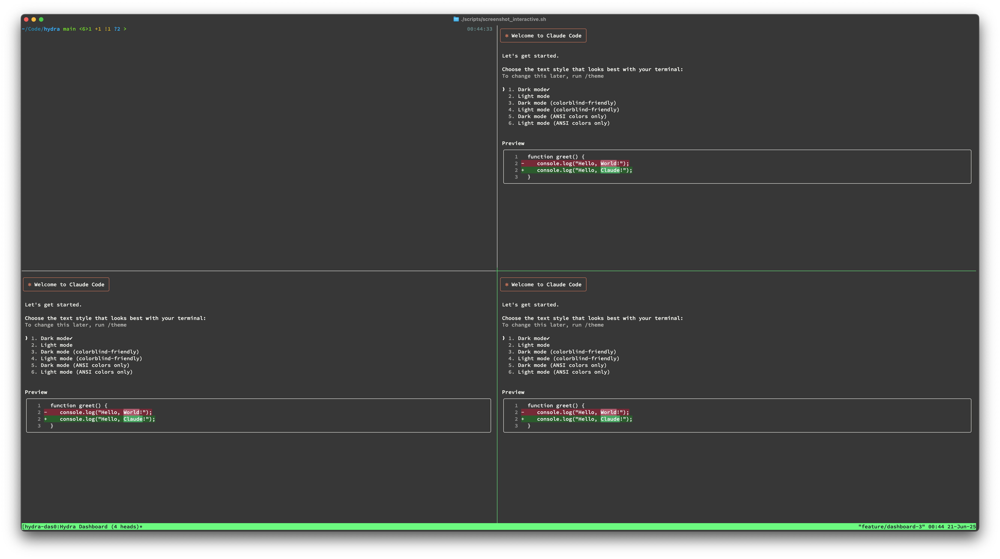
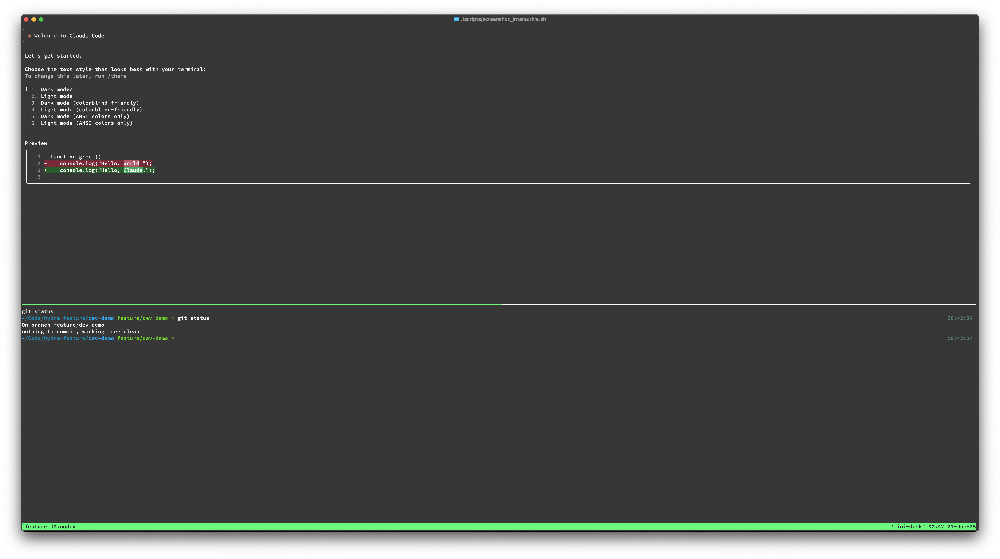
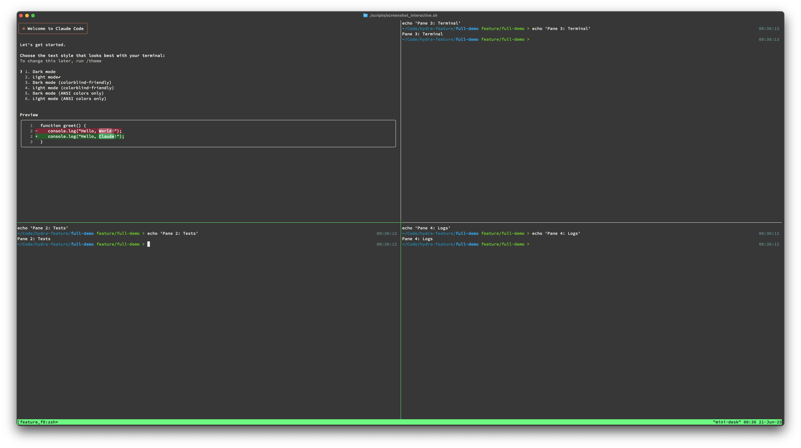
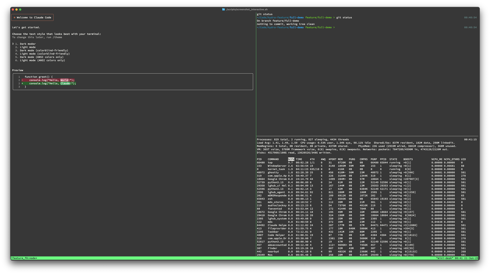
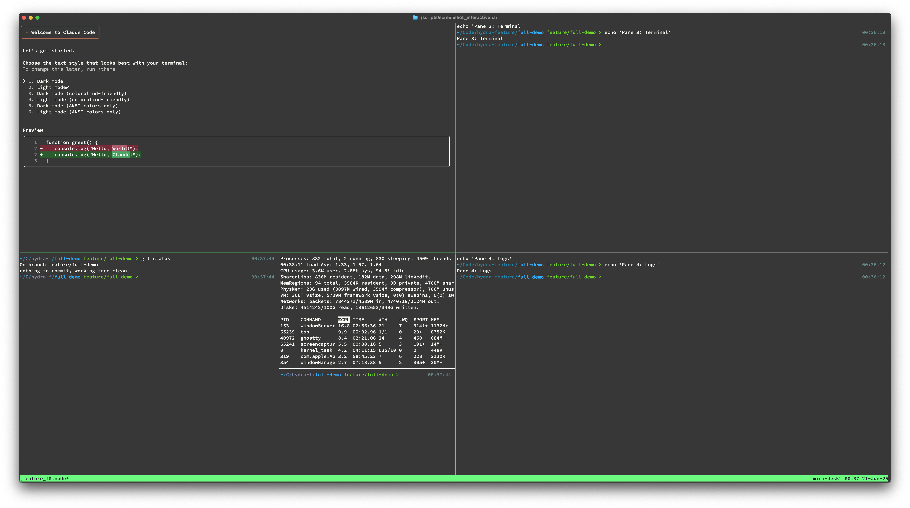

<div align="center">
    <a href="https://github.com/Someblueman/hydra">
        
    </a>
    <br>
    <div style="display: flex;">
        <a href="https://github.com/Someblueman/hydra/actions?query=workflow%3Aci">
            
        </a>
        <a href="https://github.com/Someblueman/hydra/releases">
            
        </a>
        <a href="https://github.com/Someblueman/hydra/stargazers">
            
        </a>
        <a href="https://github.com/Someblueman/hydra/blob/main/LICENSE">
            
        </a>
        <a>
            
        </a>
    </div>
    <h1>Hydra</h1>
    <p>
        <b>A POSIX-compliant CLI tool that wraps tmux ≥ 3.0 and git worktree to manage parallel AI coding sessions ("heads")</b>
    </p>
    <p>
        Work on multiple git branches simultaneously, each with its own tmux session and isolated worktree.
    </p>
</div>


## Features

- **Multiple Parallel Sessions**: Work on different branches simultaneously with isolated environments
- **tmux Integration**: Each branch gets its own tmux session with customizable layouts
- **Git Worktree Management**: Automatic creation and cleanup of git worktrees
- **GitHub Integration**: Create heads directly from GitHub issues
- **Session Persistence**: Maintains branch-to-session mappings across restarts
- **Interactive Switching**: Use fzf for quick session switching (falls back to numeric selection)
- **Performance Monitoring**: Built-in latency tracking ensures <100ms switch times

## Quick Start

### Requirements

- `/bin/sh` (POSIX shell)
- git
- tmux ≥ 3.0
- AI CLI tool (optional but recommended: claude, codex, cursor, copilot, aider, or gemini)
  - Note: gemini requires Node.js 18+ and Google account authentication
- fzf (optional, for interactive switching)
- GitHub CLI (optional, for GitHub issue integration)

### Installation

```sh
git clone https://github.com/Someblueman/hydra.git
cd hydra
sudo ./install.sh
```

Or using make:

```sh
sudo make install
```

## Usage

### Essential Commands

```sh
# Create a new head for a branch
hydra spawn feature-branch

# Create a head from a GitHub issue
hydra spawn --issue 123

# List all active heads
hydra list

# Switch between heads interactively
hydra switch

# Kill a head (removes session and worktree)
hydra kill feature-branch

# View all sessions in a unified dashboard
hydra dashboard
```

### Working with Layouts

Hydra supports three built-in layouts that can be specified during spawn or cycled through with `Ctrl-L`:

```sh
# Spawn with specific layout
hydra spawn feature-branch --layout dev      # Two panes: editor (70%) + terminal (30%)
hydra spawn feature-branch --layout full     # Three panes: editor + terminal + logs
hydra spawn feature-branch --layout default  # Single pane (default)

# Cycle through layouts in current session
hydra cycle-layout
```

**Available layouts:**
- `default`: Single pane, full screen
- `dev`: Two panes - editor (left 70%) and terminal (right 30%)
- `full`: Three panes - editor (top-left), terminal (top-right), logs (bottom)

### Dashboard View

The dashboard provides a unified view of all active Hydra sessions in a single tmux window:

```sh
hydra dashboard        # View all sessions in a grid
hydra dashboard --help # Get help about dashboard features
```

**Dashboard features:**
- Displays panes from all active sessions in a grid layout
- Press `q` to exit and restore panes to their original sessions
- Non-disruptive: panes are temporarily moved and restored on exit
- Automatically adjusts layout based on number of sessions (2x2, 3x3, etc.)

#### Collect Multiple Panes Per Session

By default, the dashboard collects just the first pane from each active session. For more complex layouts, you can collect multiple panes per session:

```sh
# Collect two panes from each session
hydra dashboard --panes-per-session 2

# Collect all panes from each session (leaves one pane per source session to keep it alive)
hydra dashboard --panes-per-session all

# Equivalent via environment variable
HYDRA_DASHBOARD_PANES_PER_SESSION=2 hydra dashboard
HYDRA_DASHBOARD_PANES_PER_SESSION=all hydra dashboard
```

Notes:
- Hydra never drains a source session completely; it always leaves at least one pane behind so your sessions remain usable while viewing the dashboard.
- Pane titles in the dashboard are set to the corresponding branch name for clarity.

### System Management

```sh
# Regenerate sessions after restart
hydra regenerate

# Check system health and performance
hydra status
hydra doctor
```

## Examples

### Dashboard with Multiple Sessions

The dashboard provides a unified view of all your active Hydra sessions:



### Development Layout

The `dev` layout provides a split view perfect for coding with an editor and terminal:



### Full Layouts

Choose from multiple full layout options for complex workflows:

**Quad Layout (2x2 grid):**


**Triple Layout (1 large + 2 small panes):**


**Six Panes Layout:**


## How It Works

1. **Spawn**: Creates a git worktree at `../hydra-{branch}` and a tmux session
2. **Mapping**: Stores branch-to-session mappings in `~/.hydra/map`
3. **Switch**: Uses tmux's `switch-client` for instant context switching
4. **Persistence**: Mappings survive system restarts; use `regenerate` to restore sessions

## Development

Hydra is strictly POSIX-compliant and works with `/bin/sh`. All scripts are validated with ShellCheck and dash.

```sh
# Run linter (requires shellcheck)
make lint

# Run tests
make test

# Clean temporary files
make clean

# Show all available targets
make help
```

See [CONTRIBUTING.md](CONTRIBUTING.md) for detailed development guidelines.

## Configuration

**Environment Variables:**
- `HYDRA_HOME`: Directory for runtime files (default: `~/.hydra`)
- `HYDRA_AI_COMMAND`: Default AI tool to use (default: `claude`)
- `HYDRA_ROOT`: Override hydra installation path for library discovery (useful when running from source)
- `HYDRA_ALLOW_ADVANCED_REFS`: Allow broader Git ref syntax for branch names and worktree paths. By default, Hydra uses a conservative
  safe character set to prevent injection and traversal issues. Setting this variable (e.g., to `1`) relaxes only the final
  charset restriction while keeping core safety checks (no whitespace/control chars, no `..` or `.` path components, no `@{`, no trailing `.` or `.lock`,
  and no leading/trailing `/`). Use with care.

Per-head AI selection:
- You can override the AI tool per head via `hydra spawn <branch> --ai <tool>`; Hydra persists this choice in the mapping file and shows it in `hydra list` and `hydra status`.
- When running `hydra regenerate`, if a head has a stored AI tool, Hydra auto-launches that tool in the regenerated session.

Advanced refs:
- `HYDRA_ALLOW_ADVANCED_REFS`: Allow broader Git ref syntax for branch names and worktree paths. By default, Hydra uses a conservative
  safe character set to prevent injection and traversal issues. Setting this variable (e.g., to `1`) relaxes only the final
  charset restriction while keeping core safety checks (no whitespace/control chars, no `..` or `.` path components, no `@{`, no trailing `.` or `.lock`,
  and no leading/trailing `/`). Use with care.

## Custom Session Configs & Hooks

Hydra supports optional per-project customization using a simple `.hydra` directory. Hydra looks for config in this order:
1. Worktree directory: `<worktree>/.hydra`
2. Repository root: `<repo>/.hydra`
3. Global: `$HYDRA_HOME`

Available hooks and files:
- `hooks/pre-spawn`: Runs before the tmux session is created. Receives env vars:
  - `HYDRA_WORKTREE`, `HYDRA_BRANCH`
- `hooks/layout`: If present, overrides built-in layouts. Runs after the tmux session is created with env:
  - `HYDRA_SESSION`, `HYDRA_WORKTREE`
- `startup`: File with one shell command per line (blank lines and lines starting with `#` are ignored). Commands are sent to the session’s main pane after spawn.
- `hooks/post-spawn`: Runs after applying layout and sending startup commands. Receives env vars:
  - `HYDRA_SESSION`, `HYDRA_WORKTREE`, `HYDRA_BRANCH`

Notes:
- Hooks are regular shell scripts executed with your user privileges; keep them trusted.
- If `hooks/layout` is absent, Hydra applies the built-in `--layout` if provided; otherwise uses `default`.

### YAML Config (config.yml or config.yaml)

Place a minimal YAML config in `.hydra/config.yml` to declare windows/panes and optional startup commands:

```yaml
windows:
  - name: editor
    dir: sub/project
    env:
      EDITOR: nvim
      NODE_ENV: development
    panes:
      - cmd: nvim
      - cmd: bash
        split: v      # or h
        dir: logs
        env:
          FOO: bar
  - name: server
    panes:
      - cmd: npm run dev
startup:
  - echo "Project ready"
```

Behavior:
- On spawn: If a YAML config is present, Hydra creates windows and panes as specified and runs `startup` commands after setup. Window-level `dir` and `env` apply to panes; pane-level settings override them. `split` can be `h` or `v`.
- On regenerate: Hydra applies YAML windows/panes as well. `startup` commands run on regenerate only if `HYDRA_REGENERATE_RUN_STARTUP` is set.

Limitations:
- The YAML parser is intentionally minimal: supports only the structure shown above (name/dir/env under windows; cmd/split/dir/env under panes; startup list). Values should be plain strings.
- Complex YAML features (anchors, nested maps beyond what is shown) are not supported.

## Uninstall

To uninstall Hydra, run the uninstall script with sudo:

```sh
sudo ./uninstall.sh
```

What it does:
- Removes the installed binary at `/usr/local/bin/hydra` and library files under `/usr/local/lib/hydra`.
- Prompts to remove user data (session mappings, layouts, dashboard state) from the following locations:
  - Custom `HYDRA_HOME` if set
  - Default `~/.hydra` (uses the invoking user’s home when run via `sudo`)

Flags:
- `--purge`: Remove user data non-interactively (both custom `HYDRA_HOME` and default `~/.hydra` if present).

Examples:
```sh
# Interactive uninstall (asks about user data)
sudo ./uninstall.sh

# Non-interactive uninstall that also removes user data
sudo ./uninstall.sh --purge
```

## Performance

Hydra targets <100ms switch latency. Run `hydra doctor` to test your system's performance and identify any bottlenecks.

## Troubleshooting

### Hydra commands fail inside hydra sessions

If you're running hydra from source and commands like `hydra list` fail when run from inside a hydra-managed session, this is likely due to library path resolution issues. Solutions:

1. **Install hydra system-wide**: Run `make install` to install hydra to `/usr/local/bin`
2. **Set HYDRA_ROOT**: Export `HYDRA_ROOT=/path/to/hydra` pointing to your hydra source directory
3. **Use absolute paths**: Call hydra using its full path instead of relying on PATH

The issue occurs because hydra sessions run in git worktrees that don't contain the library files needed by the hydra script.

## License

MIT
